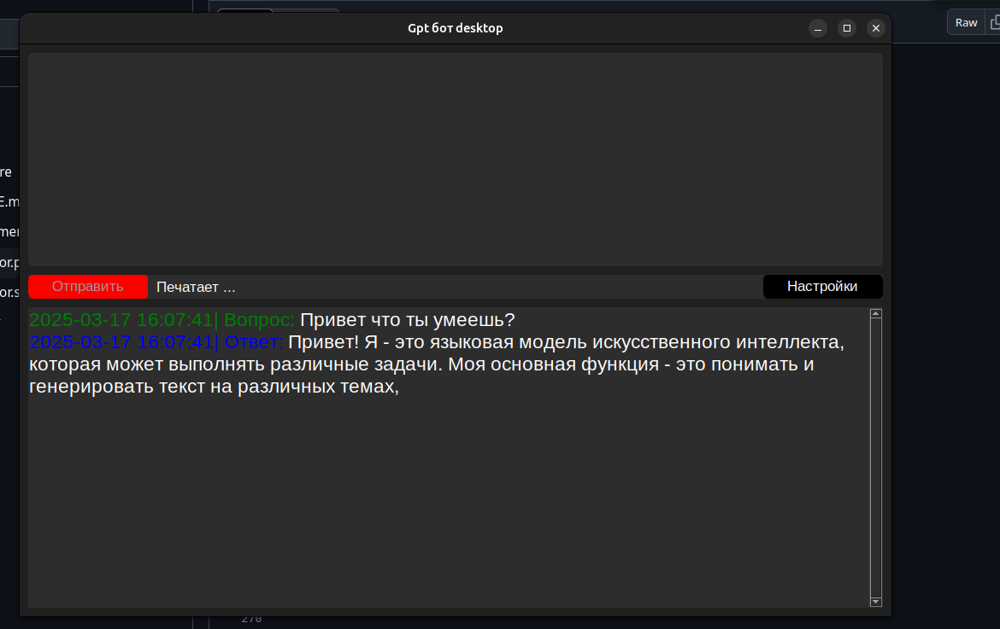
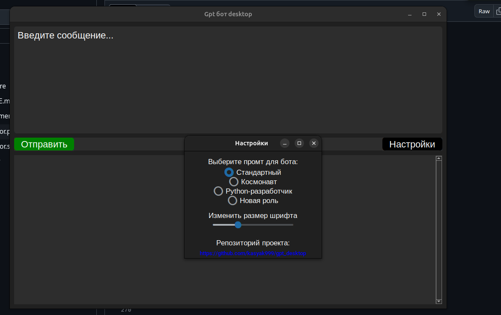

# Gpt бот desktop
## Описание
Интуитивный интерфейс для управления искусственным интеллектом.

Программа умеет:

* Вводить текстовые запросы
* Отправлять их на обработку, получать ответы в виде текста
* Выбирать роли для бота




## Необходимые условия
- Версия Python: 3.13 (может и на других версиях)
- Менеджер пакетов: pip
- ОС: Linux Ubuntu
- Место на диске не менее 5gb для модели

## Как запустить ?
- Установить виртуальное окружение и установить зависимости
    ```bash
    python -m venv venv
    pip install -r requirements.txt
    ```
- запустить main.py для скачивания модели
    ```bash
    python main.py
    ```
- Как скачается модель и откроется приложение можно его закрыть. В директории проекта появится папка **Models**
- Собрать приложение
    ```bash
    pyinstaller --onedir  main.py
    ```
- Появится папка **dest/main/**
    - Скопировать
        ```bash
        cp -r venv/lib/python3.13/site-packages/gpt4all dist/main/_internal
        ```
    - Скопировать
        ```bash
        cp -r Models /home/имя_пользователя/gpt_desktop/Models
        ```
- Готово. Теперь можно запустить.
    ```bash
    ./dist/main/main 
    ```

## Настройки

```python
model = GPT4All(
    model_name=MODEL_NAME, model_path=MODEL_DIR, device='cpu', verbose=False)
```
Здесь можно настроить модель.
- **device** - Процессор (cpu) / Видеркарта (gpu)
- **model_name** - Модель, список доступных моделей можно посмотреть тут https://docs.gpt4all.io/gpt4all_python/home.html#load-llm

Задать новую роль бота можно в методе **on_option_selected** и добавить в **MyApplication** выбор новой модели
```python
radio4 = ctk.CTkRadioButton(
    self.seting, text='Новая роль',
    variable=self.selected_option,value="option4",
    command=self.on_option_selected)
radio4.pack(pady=10)
```
